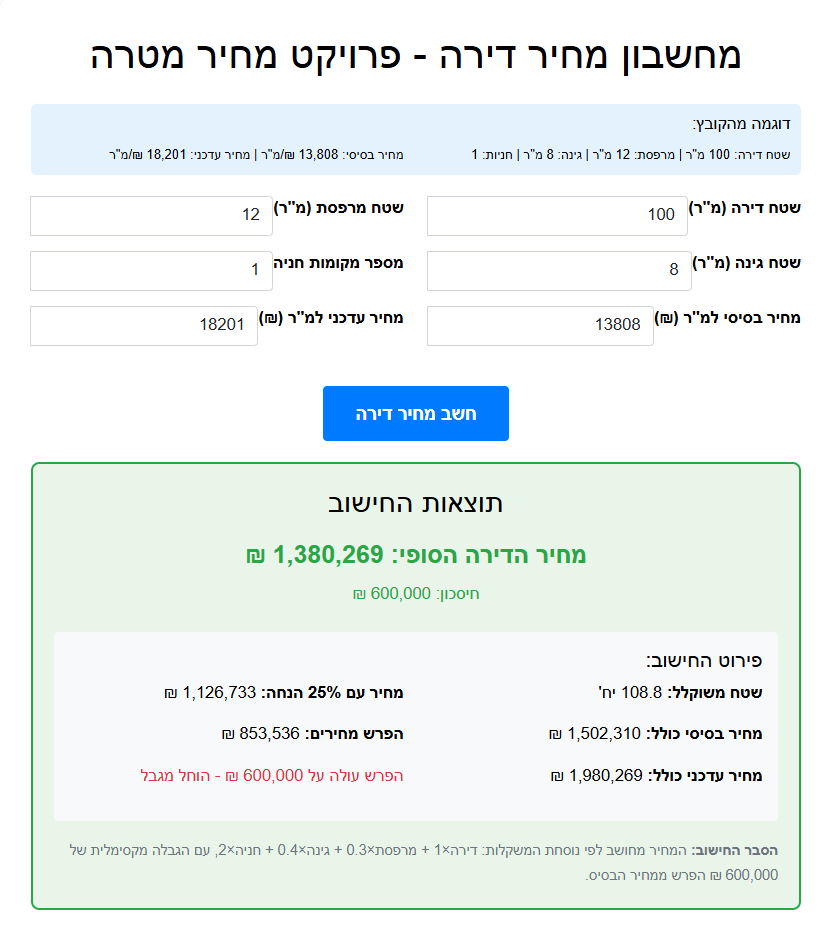

# Target Price Apartment Calculator

A FastAPI-based web application for calculating apartment target prices in Israel, taking into account various factors like location, size, and market conditions.

## Preview



## Features

- Calculate target apartment prices based on multiple parameters
- Consider location factors and market conditions
- User-friendly Hebrew interface
- Real-time price calculations
- Detailed breakdown of price components

## Getting Started

1. Install dependencies:
   ```bash
   pip install -r requirements.txt
   ```

2. Run the application:
   ```bash
   uvicorn main:app --reload
   ```

3. Open your browser and navigate to `http://localhost:8000`

## Technology Stack

- **Backend**: FastAPI
- **Frontend**: HTML/CSS/JavaScript
- **Language**: Python